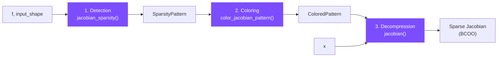
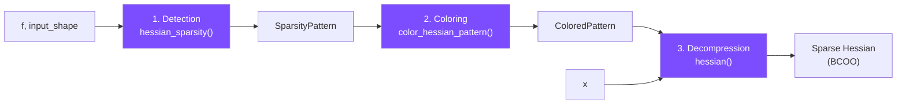
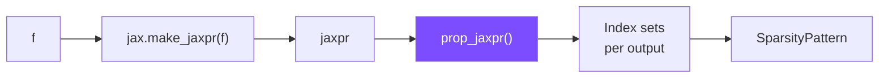
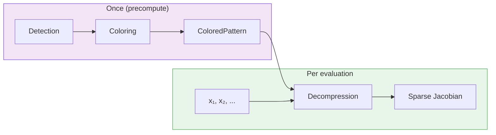

# The ASD Pipeline

`asdex` computes sparse Jacobians and Hessians through a three-stage pipeline:
**detection**, **coloring**, and **decompression**.

## Architecture Overview

### Jacobian Pipeline

The convenience function `jacobian_coloring(f, shape)` combines stages 1 and 2.

### Hessian Pipeline

Hessian detection reuses the Jacobian detector:
`hessian_sparsity(f, shape)` calls `jacobian_sparsity(jax.grad(f), shape)`.
The convenience function `hessian_coloring(f, shape)` combines stages 1 and 2.

## Stage 1: Detection

The detection stage determines *which* entries of the Jacobian (or Hessian)
may be nonzero,
without evaluating any derivatives.

`asdex` uses `jax.make_jaxpr` to trace the function
into a [jaxpr](https://docs.jax.dev/en/latest/jaxpr.html)
(JAX's intermediate representation)
and propagates **index sets** through each primitive operation.
Each input element starts with its own index \(\{i\}\),
and operations combine these sets according to their semantics.

For example, if output element 3 depends on inputs 1 and 5,
its index set is \(\{1, 5\}\),
producing nonzero entries at positions \((3, 1)\) and \((3, 5)\) in the Jacobian.

The result is a `SparsityPattern` — a global sparsity pattern
valid for all input values.

## Stage 2: Coloring

The coloring stage determines *how* to group rows (or columns)
for efficient computation.
See [Graph Coloring](coloring.md) for a detailed explanation.

The key insight:
if two rows have no nonzero columns in common,
they can be computed together in a single VJP
by adding their seed vectors.
The coloring algorithm assigns colors
so that same-colored rows (or columns) are structurally orthogonal.

The result is a `ColoredPattern`
containing the sparsity pattern, color assignments, and AD mode.

## Stage 3: Decompression

The decompression stage computes the actual sparse matrix values.

For each color, `asdex` runs one AD pass:

- **Row coloring**: one VJP per color,
  with a seed vector that has 1s at all same-colored rows
- **Column coloring**: one JVP per color,
  with a tangent vector that has 1s at all same-colored columns
- **Symmetric coloring (Hessians)**: one HVP per color,
  using forward-over-reverse AD (`jax.jvp(jax.grad(f), ...)`)

Due to the coloring constraint,
each nonzero entry can be uniquely extracted from the compressed results.
The extraction uses pre-computed index arrays for efficiency
— no Python loop over individual nonzeros.

## Design Rationale

The pipeline is split into three stages for a reason:
**detection and coloring depend only on the function structure**,
not the input values.
When computing Jacobians at many different inputs,
you pay the detection and coloring cost once,
then reuse the `ColoredPattern` for each evaluation.

This amortization is the key to performance on repeated evaluations,
which is the common case in optimization and scientific computing.
